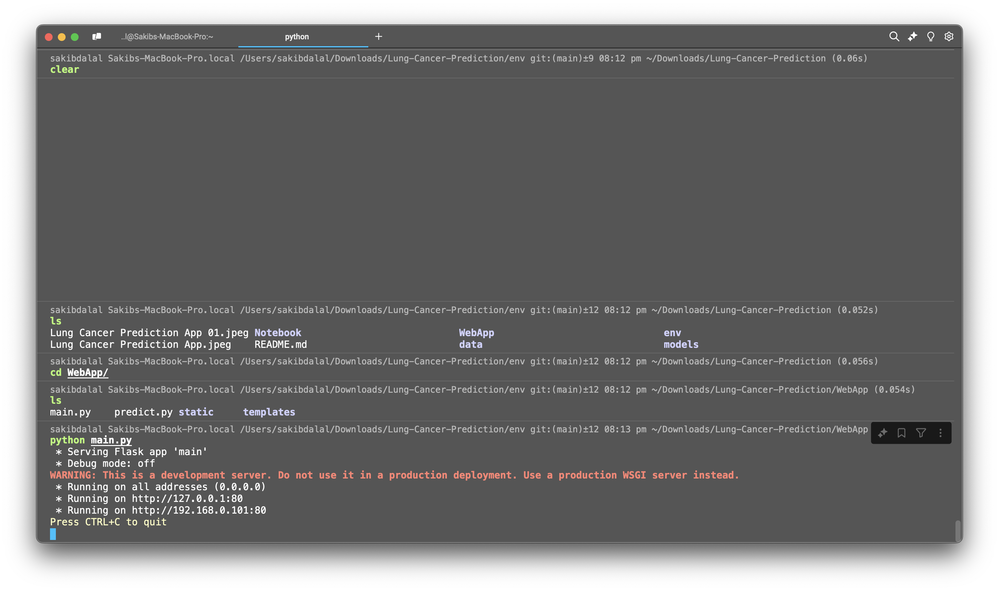

# Lung Cancer Prediction Web Application

### Disclaimer:

This Lung Cancer Prediction Web App is intended for informational and educational purposes only and should not be considered a substitute for professional medical advice, diagnosis, or treatment. The predictions generated by this tool are based on statistical models and are not definitive diagnoses.
Users should not rely on the results of this app for making medical decisions.  Always consult a qualified healthcare provider for medical advice, diagnosis, or treatment, especially if you have concerns about lung cancer or related health conditions. The creators of this app are not liable for any medical decisions made based on the predictions or insights provided by this tool.

## How To Setup
#### Use Environment 
1. We need to use `./env` setup folder to setup this tool
2. Requirement's: You need to have Anaconda or Miniconda navigator to be installed in your system.
3. use this command to activate environment 
    - `conda activate ./env`
4. Environment setup done!

#### Web App
1. Now go to `App` Directory and run this command to start WebApp server.
    - `python main.py`
2. WebApp hosted!

#### Jupyter Notebook (Optional)
1. Run Jupyter Notebook 
2. View and Edit the trained model 
3. Evaluate 
4. Train and Test

## How To Use
1. Open any web browser and paste this link
    - `http://127.0.0.1:00/`

2. Fill the required details for prediction.
3. Click on predict button

## Repository Path's

- **App**
    - `main.py`
    - `predict.py`
    - ***static***
        - ***script***
            - `index.js`
            - `style.css`
    - ***templates***
        - `index.html`
        - `none.html`
        - `predict.html`
- **Notebook**
    - `main.ipynb`

    - **data**
        - ***Lung Cancer archive.zip***
    - `survey lung cancer.csv`
    - **models**
        - `LogisticRegressionModel.pkl`
        - `RandomForestModel.pkl`
        - `SGDClassificationModel.pkl`

- `README.md`

***8 directories, 14 files***

#### In The End
- Feel free to contribute.
- Nginx feature coming soon.
- Docker feature coming soon.
- More data and better model's coming soon.